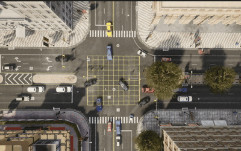
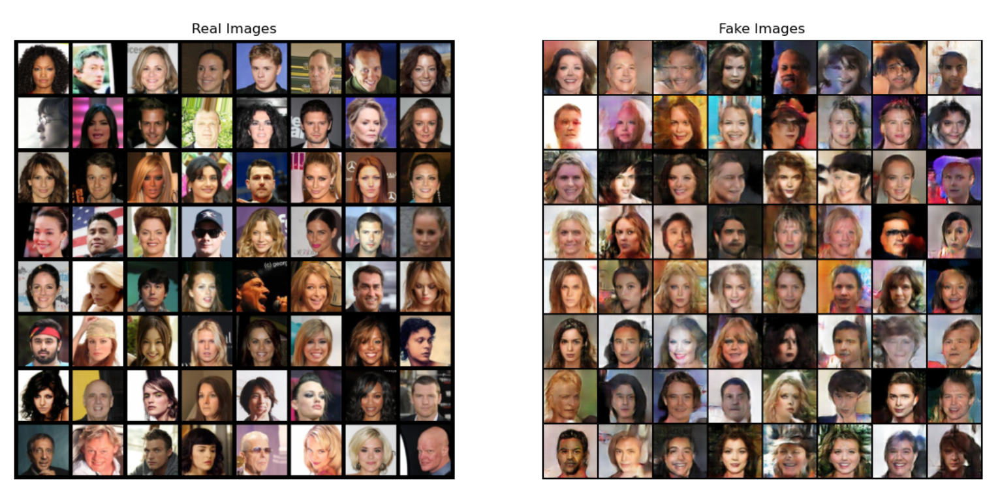
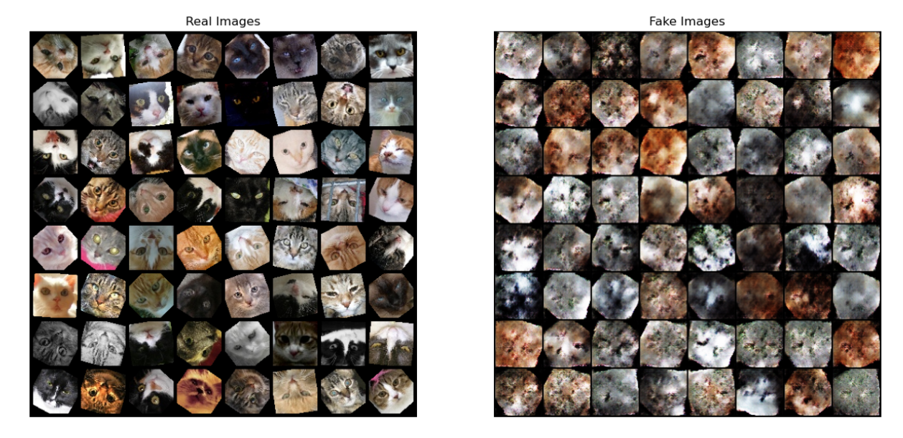
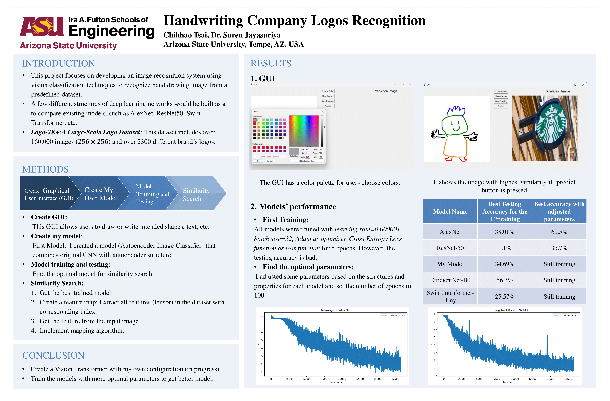
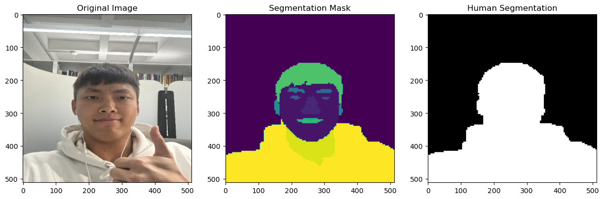
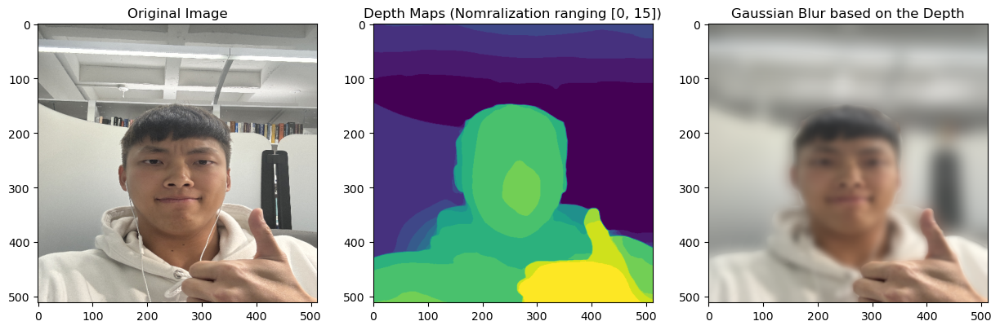
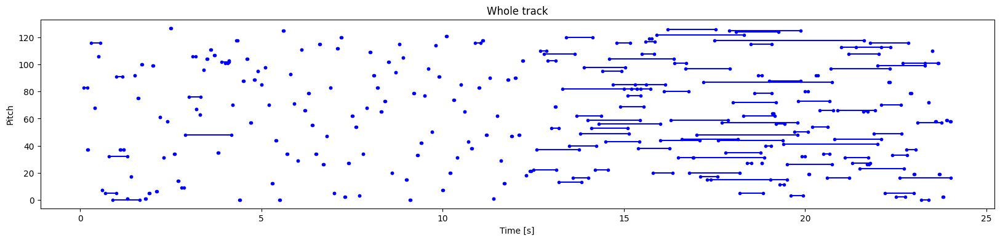
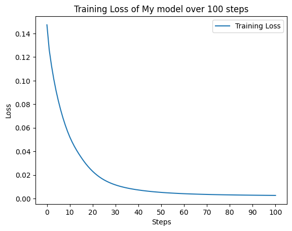
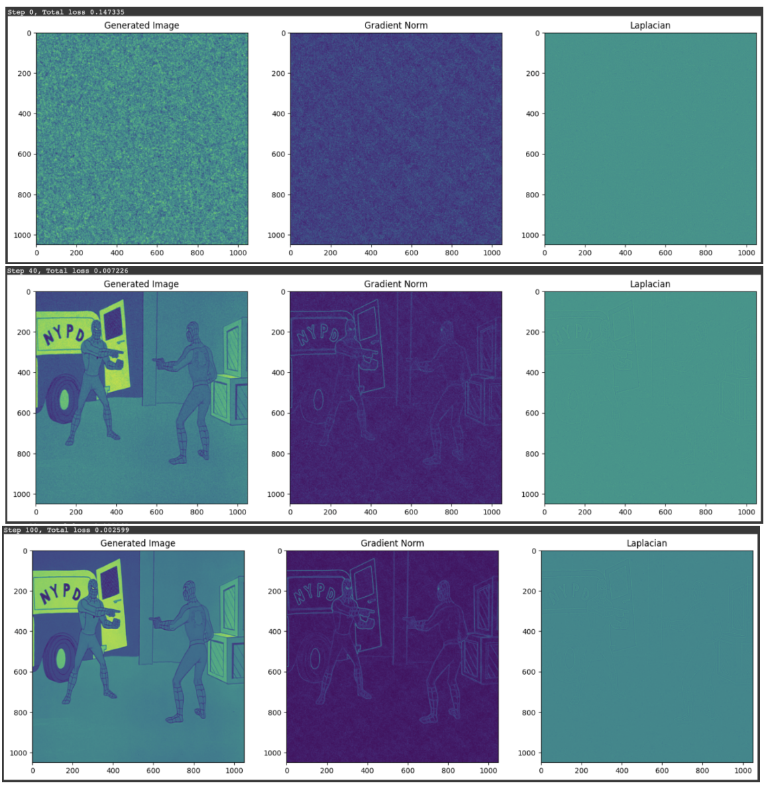

# Chih-Hao (Andy) Tsai — M.S. in Robotics & Autonomous Systems @ASU

> Autonomous Vehicle Systems • Robotics • Machine Learning (DL & RL) • Perception (Computer Vision)

[LinkedIn](https://www.linkedin.com/in/chih-hao-tsai/) · ctsai67@asu.edu · [GitHub](https://github.com/andytsai104) · [Resume (PDF)](./Resume_CT.pdf)

---


## Table of Contents
- [About Me](#about-me)
- [Technical Highlights](#technical-highlights)
- [Featured Projects](#featured-projects)
  - [Robotics & Control Systems](#--robotics--control-systems)
    - [RL-Based Pedestrian Controller in CARLA](#1-rlbased-pedestrian-controller-in-carla-jun-2025---present)
    - [Image-to-Path Planning for MyCobot Pro 600](#2-image-to-path-planning-for-mycobot-pro-600-mar-2025---may-2025)
    - [Real-Time Embedded Mobile Robot Control with Pololu 3pi+ 2040 Robot](#3-real-time-embedded-mobile-robot-control-with-pololu-3pi-2040-robot-sep-2025---dec-2025)
    - [Autonomous Mobile Vehicle and Robotic Arm](#4-autonomous-mobile-vehicle-and-robotic-arm-feb-2022--nov-2022)
  - [Deep Learning & Computer Vision](#--deep-learning--computer-vision)
    - [Generative AI – Deep Convolutional GAN](#1-generative-ai--deep-convolutional-gan-oct-2024--dec-2024)
    - [Handwriting Company Logos Recognition](#2-handwriting-company-logos-recognition-oct-2024--dec-2024)
    - [Image Segmentation with Vision Transformer](#3-image-segmentation-with-vision-transformer-oct-2024--nov-2024)
    - [Music Generation with GRUs](#4-music-generation-with-grus-oct-2024--nov-2024)
    - [Positional Encoding Research](#5-positional-encoding-research-oct-2024--nov-2024)
    - [Custom ResNet-36 Model for ImageNet Training](#6-custom-resnet-36-model-for-imagenet-training-sep-2024--oct-2024)
- [Contact](#contact)

---

## About Me
I’m a graduate student in **Robotics and Autonomous Systems** at **Arizona State University**, expected to graduate in **May 2026**. I’m passionate about **robotics, motion planning, and intelligent systems**, and enjoy building solutions that combine control, perception, and learning.

With a background in **mechanical and electrical engineering**, I’ve led and contributed to projects involving **robotic arm control**, **autonomous vehicles**, **real-time embedded robot systems control**, **multi-robot systems control**, and **image-based path planning**. I also have experience training **deep learning models** for **image generation**, **image segmentation**, and **pedestrian trajectory prediction**. My technical expertise includes **Python (PyTorch, TensorFlow, OpenCV)**, **ROS 2**, **Linux**, **MATLAB**, **Simulink**, **C/C++**, **SolidWorks**, **Deep Learning**, and **Reinforcement Learning**.

I’m especially interested in how learning-based systems can enhance robot autonomy — enabling machines to move, perceive, and make decisions safely in complex environments.

---

## Technical Highlights

| Category | Skills & Tools | Proficiency / Focus |
|:--|:--|:--|
| **Programming** | Python (PyTorch, TensorFlow, OpenCV), MATLAB, Bash, C/C++ | Python – Advanced<br>MATLAB – Intermediate<br>Bash – Intermediate<br>C/C++ – Intermediate (Embedded) |
| **Robotics & Systems** | ROS 2 (RViz, Gazebo), Path Planning & Motion Control, Multi-agent Control, Real-time Control Loops, PID Control, Arduino | ROS 2 – Intermediate<br>Planning/Control – Intermediate<br>Multi-agent Control – Intermediate<br>Real-time Control Loops – Intermediate<br>PID/Arduino – Entry |
| **Tools** | Linux, Git, Simulink, SolidWorks | Linux – Intermediate<br>Git – Intermediate<br>Simulink – Intermediate<br>SolidWorks – Intermediate |
| **Simulations** | RViz, Gazebo, CARLA | RViz – Intermediate<br>Gazebo – Intermediate<br>CARLA – Entry |
| **Machine Learning** | Deep Learning (CNN, GAN, ViT), Reinforcement Learning (TD3, SAC, PPO), General ML Techniques | DL – Intermediate<br>RL – Intermediate<br>ML – Intermediate |
| **Current Focus** | Multi-agent RL, Vision-based motion planning, Autonomous systems simulation | Research / Ongoing |


---
## Featured Projects

### - Robotics & Control Systems

#### 1) RL‑Based Pedestrian Controller in CARLA (Jun 2025 - Present)
**Skills:** Python · PyTorch · CARLA · Social‑LSTM · TD3 · Vision Transformer  
- Designed a multi-agent pedestrian controller integrating Social-LSTM and TD3 reinforcement learning.  
- Implemented BEV-based perception with Vision Transformer encoders.  
- Trained agents to simulate realistic and aggressive pedestrian behavior for autonomous vehicle safety.

**Repo:** [Dense Deep Reinforcement Learning](https://github.com/andytsai104/Dense-Deep-Reinforcement-Learning)

**Demo:**
<p align="center">
  
  <br>
  <b>Vehicles perfoming aggressive actions towards pedestrians and other vehicles</b>
</p>

---

#### 2) Image‑to‑Path Planning for MyCobot Pro 600 (Mar 2025 - May 2025)
**Skills:** Python · OpenCV · ROS 2 · RViz · Gazebo · Forward/Inverse Kinematics   
- Designed a **ROS 2-based control pipeline** for a 6-DOF **MyCobot Pro 600** robotic arm to follow paths extracted from camera images.  
- Developed an **image-processing workflow** using **OpenCV** for maze solving — color detection, morphological preprocessing, **skeletonization**, and **A\*** path planning.  
- Built a **digital twin (URDF)** of the robot using **SolidWorks** for visualization and motion testing in **RViz** and **Gazebo**.  
- Implemented **inverse kinematics** via a modified Denavit–Hartenberg model, enforcing the constraint for physical feasibility.  
- Executed and tuned **joint trajectories** on both simulated and real hardware through **TCP/IP** control for smooth motion performance.
- Built a ROS 2 + Gazebo simulation for the **Dobot Magician Lite** robotic arm. 

**Repo:** [Robotics I](https://github.com/andytsai104/Robotics-I-RAS545/tree/main/Labs)

**Demo:**
<p align="center">
  
</p>

---

#### 3) Real-Time Embedded Mobile Robot Control with Pololu 3pi+ 2040 Robot (Sep 2025 - Dec 2025)
**Skills:**  C/C++ · Embedded Systems · Real-Time Systems · PID/Feedback Control · Sensor Integration · State Machines 
- Built a modular mobile-robot controller for CSE522 (Real-Time Embedded Systems) with multiple behavior modes.
- Implemented and tuned autonomous behaviors including line tracking, hill climbing, and obstacle avoidance, with additional modules for different scenarios.
- Integrated sensor readings into real-time control loops and used structured debugging/testing to improve stability and responsiveness.

**Repo:** [Pololu Robot](https://github.com/andytsai104/pololu_robot)

**Demo:**
<table align="center">
  <tr>
    <td align="center">
      
      <br />
      <b>Hill Climbing</b>
    </td>
    <td align="center">
      
      <br />
      <b>Line Tracking</b>
    </td>
  </tr>
</table>

---

#### 4) Autonomous Mobile Vehicle and Robotic Arm (Feb 2022 – Nov 2022)
**Skills:** Python · TensorFlow · OpenCV · SolidWorks · Arduino  
- Designed an **autonomous vehicle** with an attached robotic arm for object relocation tasks.  
- Implemented **object detection** using TensorFlow and OpenCV on a WebCam.  
- Created 3D-printed components via **SolidWorks CAD modeling**.  
- Integrated **motor control**, **object detection**, and **robotic actuation** for full system automation.

---

### - Deep Learning & Computer Vision

#### 1) Generative AI – Deep Convolutional GAN (Oct 2024 – Dec 2024) 
**Skills:** Python · PyTorch  
- Trained a **DCGAN** model on the CelebA dataset to generate realistic human faces.  
- Implemented **image augmentation** and tuned hyperparameters for better convergence.  
- Extended the model to generate diverse datasets (e.g., cat faces, noisy color images).

**Repo:** [Generative AI – Deep Convolutional GAN](https://github.com/andytsai104/Deep-Learning-and-Application-EEE598-/tree/main/HW/HW4/P4)

**Demo:**
<p align="center">
  
</p>
<p align="center">
  
</p>

---

#### 2) Handwriting Company Logos Recognition (Oct 2024 – Dec 2024)
**Skills:** Python · PyTorch · CNNs · Transformers  
- Developed an **image recognition system** using **CNNs and Swin Transformer** models on a 2K+ logo dataset (160k+ images).  
- Built a **custom CNN autoencoder** with 50+ layers for feature extraction and classification.  
- Designed a **Tkinter GUI** for real-time logo similarity matching.  
- Achieved **60% accuracy** using fine-tuned **EfficientNet** and **ResNet** models.

**Repo:** [Handwriting Company Logos Recognition](https://github.com/andytsai104/Deep-Learning-and-Application-EEE598-/tree/main/FinalProject)

**Demo:**
<p align="center">
  
</p>

---

#### 3) Image Segmentation with Vision Transformer (Oct 2024 – Nov 2024)
**Skills:** Python · PyTorch · Vision Transformer (ViT)  
- Fine-tuned a **Vision Transformer** for **object-background segmentation**.  
- Applied **Gaussian blur** post-segmentation for enhanced visual focus.  
- Integrated **depth estimation transformer** to infer image depth layers with adaptive normalization.

**Repo:** [Image Segmentation with Vision Transformer](https://github.com/andytsai104/Deep-Learning-and-Application-EEE598-/tree/main/HW/HW4/P3)

**Demo:**
<p align="center">
  
</p>
<p align="center">
  
</p>

---

#### 4) Music Generation with GRUs (Oct 2024 – Nov 2024)
**Skills:** Python · PyTorch · GRU  
- Designed a **sequence-generating RNN** using **Gated Recurrent Units (GRU)**.  
- Trained on the **MAESTRO** dataset to produce AI-generated music.  
- Customized **feature-based input conditioning** for stylistic variation.

**Repo:** [Music Generation with GRUs](https://github.com/andytsai104/Deep-Learning-and-Application-EEE598-/tree/main/HW/HW4/P1)  

**Demo:**
<p align="center">
  
</p>

---

#### 5) Positional Encoding Research (Oct 2024 – Nov 2024)
**Skills:** Python · PyTorch · Deep Neural Networks  
- Reimplemented **SIREN (Sinusoidal Representation Network)** with a novel positional encoding mechanism.  
- Achieved **90% faster loss convergence** and lower reconstruction error.  
- Generated **high-resolution implicit representations** using optimized positional encoders.

**Repo:** [Positional Encoding Research](https://github.com/andytsai104/Deep-Learning-and-Application-EEE598-/tree/main/HW/HW4/P2)

**Demo:**
<p align="center">
  
</p>
<p align="center">
  
</p>

---

#### 6) Custom ResNet-36 Model for ImageNet Training (Sep 2024 – Oct 2024)
**Skills:** Python · PyTorch · Cloud High-Performance Computing (HPC)  
- Reconstructed **ResNet-36** based on research literature and trained it on the **ImageNet** dataset.  
- Proposed a **novel activation function** for deeper feature expressivity.

**Repo:** [Custom ResNet-36 Model for ImageNet Training](https://github.com/andytsai104/Deep-Learning-and-Application-EEE598-/tree/main/HW/HW3/P3)

---

<!--

## Publications & Reports
- RAS 545 / Multi‑Robot Systems reports (selected): <links>  
- Capstone/Research notes (Robust RL for pedestrians): <link>

-->

## Contact
- Email: ctsai67@asu.edu  
- LinkedIn: [Chih-Hao (Andy) Tsai](https://www.linkedin.com/in/chih-hao-tsai/) 
- For collaborations/internships (CPT/STEM OPT eligible), feel free to reach out.

---

<!--
### Repo Structure (recommended)
```
resume-portfolio/
├─ README.md                # this file
├─ Andy_Tsai_Resume.pdf     # exported resume
├─ media/                   # images, gifs for projects
│  ├─ carla_ped_demo.gif
│  └─ maze_solver.png
└─ projects/                # optional: brief writeups
   ├─ carla-pedestrian.md
   └─ mycobot-image-path.md
```

### Badges (optional)
You can add CI/test coverage or tech stack badges if you use actions:
```


```
-->
