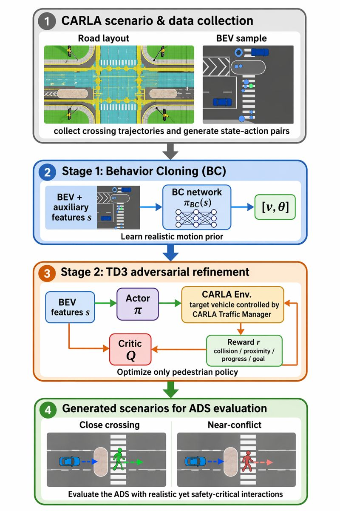
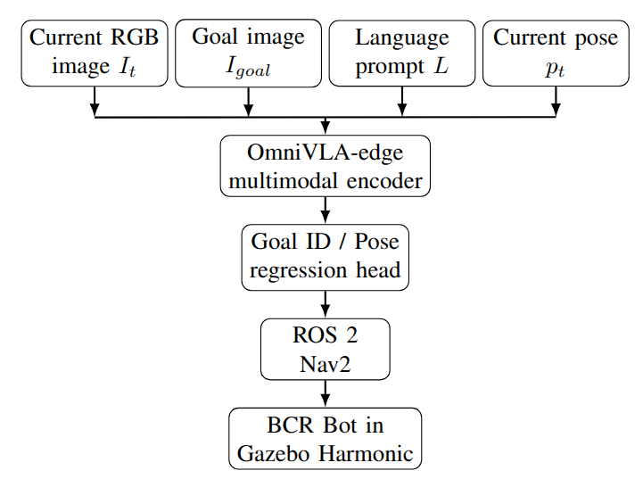
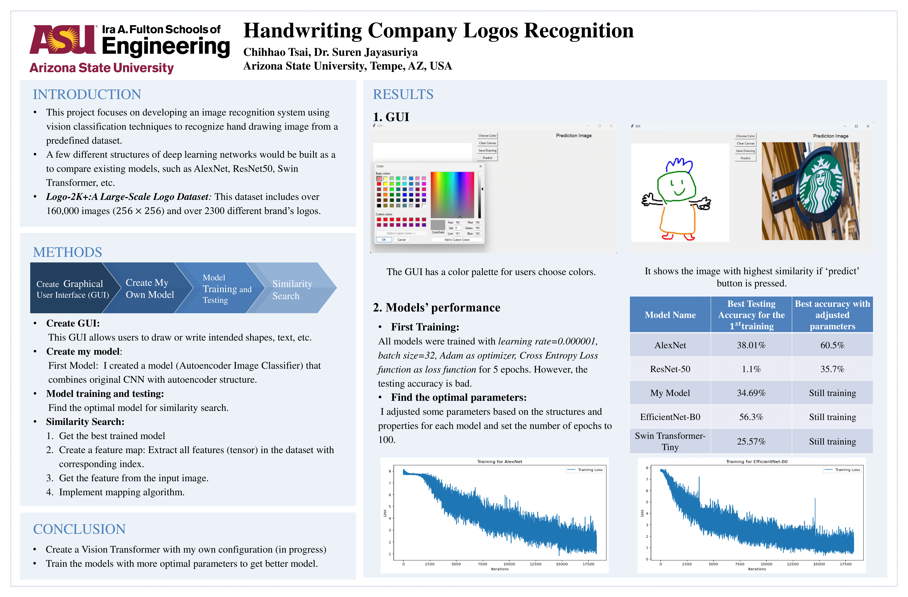
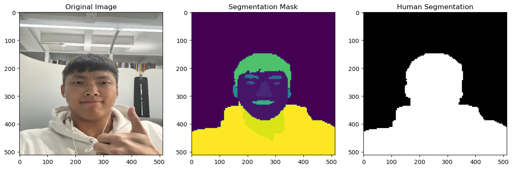
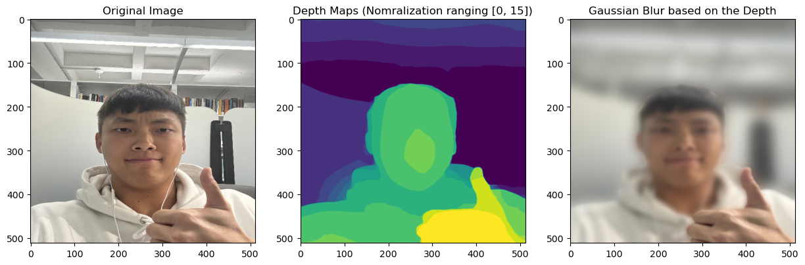
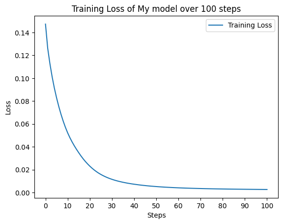
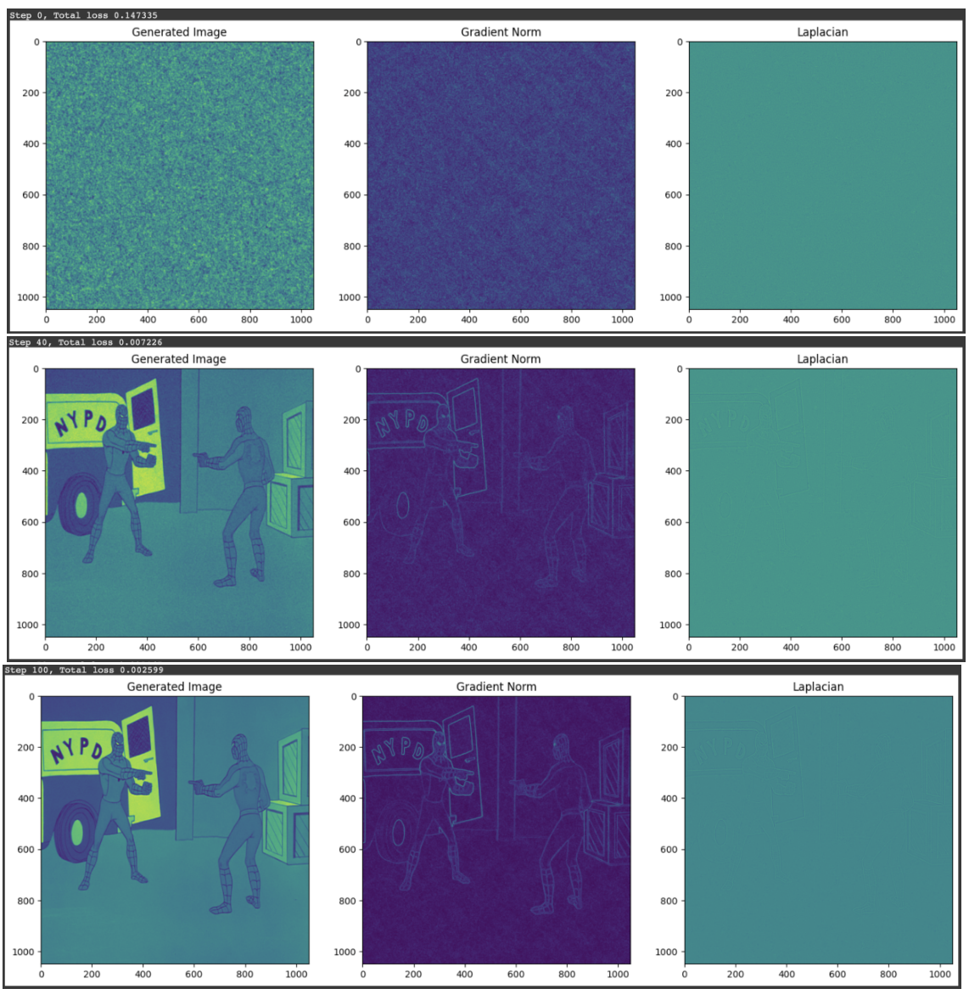

# Chih-Hao (Andy) Tsai — M.S. in Robotics & Autonomous Systems @ ASU

> Autonomous Systems • Robot Learning • ROS 2 • Multi-Robot Systems • AV Simulation

[](https://www.linkedin.com/in/chih-hao-tsai/)
[](mailto:ctsai67@asu.edu)
[](https://github.com/andytsai104)
[](./Resume_CT.pdf)

---


## Table of Contents
<!-- - [About Me](#about-me)
- [Technical Highlights](#technical-highlights)
- [Featured Projects](#featured-projects)
  - [Robotics & Control Systems](#--robotics--control-systems)
    - [RL-Based Pedestrian Controller in CARLA](#1-rlbased-pedestrian-controller-in-carla-jun-2025---present)
    - [Image-to-Path Planning for MyCobot Pro 600](#2-imagetopath-planning-for-mycobot-pro-600-mar-2025---may-2025)
    - [Real-Time Embedded Mobile Robot Control with Pololu 3pi+ 2040 Robot](#3-real-time-embedded-mobile-robot-control-with-pololu-3pi-2040-robot-sep-2025---dec-2025)
    - [Autonomous Mobile Vehicle and Robotic Arm](#4-autonomous-mobile-vehicle-and-robotic-arm-feb-2022--nov-2022)
  - [Deep Learning & Computer Vision](#--deep-learning--computer-vision)
    - [Generative AI – Deep Convolutional GAN](#1-generative-ai--deep-convolutional-gan-oct-2024--dec-2024)
    - [Handwriting Company Logos Recognition](#2-handwriting-company-logos-recognition-oct-2024--dec-2024)
    - [Image Segmentation with Vision Transformer](#3-image-segmentation-with-vision-transformer-oct-2024--nov-2024)
    - [Music Generation with GRUs](#4-music-generation-with-grus-oct-2024--nov-2024)
    - [Positional Encoding Research](#5-positional-encoding-research-oct-2024--nov-2024)
    - [Custom ResNet-36 Model for ImageNet Training](#6-custom-resnet-36-model-for-imagenet-training-sep-2024--oct-2024)
- [Contact](#contact) -->


## Table of Contents
- [About Me](#about-me)
- [Current Research Focus](#current-research-focus)
- [Technical Highlights](#technical-highlights)
- [Featured Robotics Projects](#featured-robotics--autonomous-systems-projects)
- [Selected Machine Learning Projects](#selected-machine-learning-projects)
- [Contact](#contact)

---

## About Me

I’m a graduate student in **Robotics and Autonomous Systems** at **Arizona State University**, expected to graduate in **May 2026**.

My work focuses on building autonomous robotic systems that combine **perception, planning, control, and machine learning**. I’m particularly interested in:
- robot learning,
- autonomous navigation,
- multi-robot systems,
- and simulation-driven robotics research.

My recent projects involve:
- safety-critical pedestrian policy learning in **CARLA**,
- semantic robot navigation using **Vision-Language-Action (VLA)** models,
- distributed multi-robot task allocation,
- and vision-based robotic manipulation using **ROS 2**.

I primarily work with **ROS 2**, **CARLA**, **Gazebo**, **PyTorch**, **OpenCV**, and **Linux-based robotics systems**.

---

## Current Research Focus

- Safety-critical pedestrian policy learning for autonomous vehicle testing
- Vision-Language-Action (VLA) navigation systems using ROS 2
- Distributed multi-robot task allocation and coordination
- Vision-based robotic manipulation and path planning
- Simulation-driven robotics research in CARLA and Gazebo

---

## Technical Highlights

| Category | Skills & Tools |
|:--|:--|
| **Programming** | Python (PyTorch, TensorFlow, OpenCV), MATLAB, Bash, C/C++ |
| **Robotics & Systems** | ROS 2, Nav2, RViz, Gazebo, Motion Planning, Multi-Agent Systems, PID Control |
| **Simulation** | CARLA, Gazebo Fortress/Harmonic |
| **Tools** | Linux, Git, Simulink, SolidWorks |
| **Machine Learning** | Deep Learning, Reinforcement Learning, Computer Vision, Vision-Language-Action Models, Behavior Cloning |


---
## Featured Robotics & Autonomous Systems Projects
Most of my recent work focuses on autonomous robotic systems that integrate perception, planning, control, simulation, and machine learning.


### 1) RL-Based Pedestrian Policy Learning in CARLA (Jun 2025 – Apr 2026)

**Skills:** Python · PyTorch · CARLA · TD3 · Behavior Cloning · BEV Perception · Reinforcement Learning

- Developed a closed-loop pedestrian policy-learning framework in CARLA for safety-critical autonomous-driving scenario generation.
- Trained Behavior Cloning (BC) policies from crossing demonstrations and refined them using TD3 reinforcement learning.
- Designed BEV-based observations with kinematic and goal-conditioned features for continuous pedestrian control.
- Increased collision-critical interactions from 0% to 45% while preserving behaviorally plausible crossing motions.

**Research Focus**
- Safety-critical AV testing
- Adversarial pedestrian behavior generation
- Imitation learning + reinforcement learning
- Simulation-based autonomous systems validation

**Repo:** [Adversarial Pedestrian Policy Learning](https://github.com/andytsai104/adversarial-pedestrian-policy-learning)

**Demo:**
<!-- TODO: Update demo gif -->
<p align="center">
  
</p>

<p align="center">
  
  <br>
  <b>BC-initialized TD3 framework for safety-critical pedestrian policy learning in CARLA.</b>
</p>


**Associated Paper:**  
Closed-Loop Pedestrian Policy Learning for Safety-Critical Scenario Generation in Autonomous Driving  
Submitted to MECC 2026.

---

### 2) OmniVLA Semantic Warehouse Navigation (Jan 2026 – Apr 2026)

**Skills:** ROS 2 Jazzy · Gazebo Harmonic · Nav2 · OmniVLA-edge · PyTorch · Vision-Language-Action Models

- Built a semantic warehouse navigation framework using OmniVLA-edge, ROS 2 Jazzy, Gazebo Harmonic, and Nav2.
- Developed a semantic goal library with language aliases, goal images, and warehouse navigation poses.
- Built a ROS 2 data-collection and JSONL export pipeline for VLA fine-tuning.
- Fine-tuned OmniVLA-edge for semantic goal prediction, achieving 97.57% validation accuracy and ~80% evaluation accuracy.

**Research Focus**
- Vision-Language-Action (VLA) robotics
- Semantic robot navigation
- Embodied AI systems
- Autonomous warehouse robotics

**Repo:** [OmniVLA Navigation in Gazebo](https://github.com/andytsai104/omnivla_nav_gazebo)

**Demo:**
<p align="center">
  
  <br>
</p>


<p align="center">
  
  <br>
  <b>ROS 2 pipeline for OmniVLA-based semantic goal prediction and Nav2 warehouse navigation.</b>
</p>
---

### 3) Consensus-Based Multi-Robot Warehouse Task Allocation (Aug 2025 – Dec 2025)

**Skills:** ROS 2 Humble · Gazebo Fortress · Nav2 · Multi-Agent Systems · Graph Theory

- Built a distributed Max-Consensus task-allocation framework with distance-based bidding and one-task-per-robot assignment.
- Implemented a ROS 2 + Gazebo warehouse simulation using differential-drive robots with simulated 2D LiDAR.
- Connected consensus outputs to Nav2 goal dispatch and task-execution monitoring.
- Verified finite-time convergence and conflict-free task allocation under communication constraints.

**Research Focus**
- Distributed robotics
- Multi-agent coordination
- Consensus algorithms
- Autonomous warehouse systems

**Repo:** [Consensus Warehouse Robots](https://github.com/andytsai104/consensus_warehouse_robots)

**Demo:**
<p align="center">
  
  <br>
</p>

---

### 4) Vision-Based Maze Solving & Path Planning with MyCobot Pro 600 (Mar 2025 – May 2025)

**Skills:** ROS 2 · OpenCV · RViz · Gazebo · Inverse Kinematics · Motion Planning

- Developed a ROS 2 pipeline for maze solving and path execution using a 6-DOF MyCobot Pro 600 robotic arm.
- Implemented image-based maze processing with OpenCV, including skeletonization and A* path planning.
- Built a URDF-based digital twin for visualization and motion testing in RViz and Gazebo.
- Executed planned trajectories on both simulation and physical hardware via TCP/IP control.

**Research Focus**
- Vision-based robotics
- Robot manipulation
- Image-based path planning
- Kinematics and motion execution

**Repo:** [Robotics I](https://github.com/andytsai104/Robotics-I-RAS545/tree/main/Labs)

**Demo:**
<p align="center">
  
</p>

---

### 5) Real-Time Embedded Robotics with Pololu 3pi+ 2040 (Sep 2025 – Dec 2025)

**Skills:** C/C++ · Embedded Systems · Real-Time Control · Sensor Integration · PID Control

- Developed autonomous robot behaviors using IMU, encoders, gyroscope, IR sensors, and bump sensors.
- Implemented line following with IR calibration, lateral-error estimation, and differential-drive control.
- Designed ramp edge-detection and recovery behaviors using real-time sensor feedback.
- Integrated multiple control modes for robust embedded robot navigation.

**Repo:** [Pololu Robot](https://github.com/andytsai104/pololu_robot)

**Demo:**
<table align="center">
  <tr>
    <td align="center">
      
      <br />
      <b>Hill Climbing</b>
    </td>
    <td align="center">
      
      <br />
      <b>Line Tracking</b>
    </td>
  </tr>
</table>

---

### 6) Autonomous Mobile Vehicle and Robotic Arm (Feb 2022 – Nov 2022)

**Skills:** Python · TensorFlow · OpenCV · SolidWorks · Arduino

- Built an autonomous mobile vehicle with an integrated robotic arm for object relocation.
- Implemented webcam-based object detection using TensorFlow and OpenCV.
- Designed and fabricated robot components using SolidWorks and 3D printing.
- Integrated robotic actuation and motor control on Arduino-based hardware.

---

## Supporting Machine Learning & Computer Vision Projects

### 1) Handwriting Company Logos Recognition (Oct 2024 – Dec 2024)

**Skills:** PyTorch · CNNs · Swin Transformer · Computer Vision · GUI Development

- Developed a logo-recognition system using CNNs and Swin Transformer models on a 160k+ image dataset.
- Built a custom CNN autoencoder for feature extraction and similarity-based image retrieval.
- Designed a Tkinter GUI for real-time logo prediction and similarity matching.
- Achieved 60% classification accuracy using fine-tuned EfficientNet models.

**Repo:** [Handwriting Company Logos Recognition](https://github.com/andytsai104/Deep-Learning-and-Application-EEE598-/tree/main/FinalProject)
**Demo:**
<p align="center">
  
</p>

---

### 2) Image Segmentation with Vision Transformer (Oct 2024 – Nov 2024)

**Skills:** PyTorch · Vision Transformer · Image Segmentation · Depth Estimation

- Fine-tuned Vision Transformer models for foreground-background image segmentation.
- Applied depth-aware post-processing for adaptive image blurring and scene enhancement.
- Integrated transformer-based depth estimation for layered scene understanding.

**Repo:** [Image Segmentation with Vision Transformer](https://github.com/andytsai104/Deep-Learning-and-Application-EEE598-/tree/main/HW/HW4/P3)

**Demo:**
<p align="center">
  
</p>
<p align="center">
  
</p>

---

### 3) Positional Encoding Research (Oct 2024 – Nov 2024)

**Skills:** PyTorch · Neural Representations · Positional Encoding

- Reimplemented SIREN-based implicit neural representations with modified positional encoding strategies.
- Improved training convergence and reconstruction quality for high-resolution implicit representations.

**Repo:** [Positional Encoding Research](https://github.com/andytsai104/Deep-Learning-and-Application-EEE598-/tree/main/HW/HW4/P2)
**Demo:**
<p align="center">
  
</p>
<p align="center">
  
</p>


## Other Coursework Projects

- [Deep Convolutional GAN (DCGAN) for synthetic image generation](https://github.com/andytsai104/Deep-Learning-and-Application-EEE598-/tree/main/HW/HW4/P4)
- [GRU-based music generation using the MAESTRO dataset](https://github.com/andytsai104/Deep-Learning-and-Application-EEE598-/tree/main/HW/HW4/P1)
- [Custom ResNet-36 implementation and ImageNet training](https://github.com/andytsai104/Deep-Learning-and-Application-EEE598-/tree/main/HW/HW3/P3)
<!-- - Additional deep learning and computer vision coursework projects -->


---

## Contact
- **Email:** [ctsai67@asu.edu](mailto:ctsai67@asu.edu)  
- **LinkedIn:** [Chih-Hao (Andy) Tsai](https://www.linkedin.com/in/chih-hao-tsai/)
- **GitHub:** [github.com/andytsai104](https://github.com/andytsai104)
- For collaborations/internships (CPT/STEM OPT eligible), feel free to reach out.

---

<!--
### Repo Structure (recommended)
```
resume-portfolio/
├─ README.md                # this file
├─ Andy_Tsai_Resume.pdf     # exported resume
├─ media/                   # images, gifs for projects
│  ├─ carla_ped_demo.gif
│  └─ maze_solver.png
└─ projects/                # optional: brief writeups
   ├─ carla-pedestrian.md
   └─ mycobot-image-path.md
```

### Badges (optional)
You can add CI/test coverage or tech stack badges if you use actions:
```


```
-->
